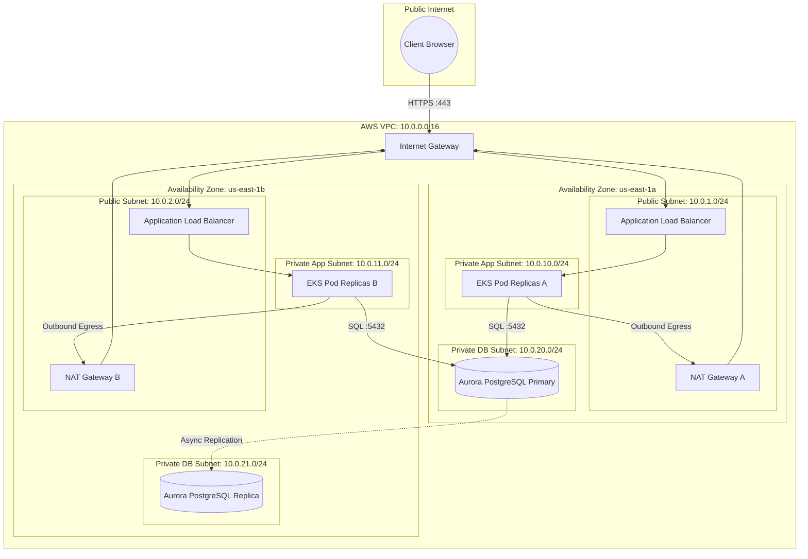

# Skill: Cloud Topology & Multi-AZ Network Diagram Synthesis
`id`: `kbcodedev/cloud-topology-network-diagram`  
`category`: `17-visual-architecture-diagrams`  
`version`: `2.0.0`  
`type`: `advanced-simplified`

---

## 1. Intent & Trigger Conditions
- **When to Use**: Synthesizing cloud infrastructure diagrams (AWS, GCP, Azure), Virtual Private Cloud (VPC) network topologies, Multi-Availability Zone (Multi-AZ) failovers, private subnets, NAT gateways, and Application Load Balancer routing in Mermaid.
- **Triggers**: Cloud infrastructure design, network security audits, disaster recovery topology planning, VPC setup RFCs.
- **Prerequisites**: Cloud provider architecture, CIDR blocks (`10.0.0.0/16`), availability zone requirements.

---

## 2. Core Mental Model & Invariant Principles
1. **Public vs Private Subnet Isolation**: Internet-facing resources (ALB, Bastion, NAT Gateway) reside in Public Subnets; compute and databases (EKS Pods, RDS Aurora) reside strictly in Private Subnets with zero public IP addresses.
2. **Multi-AZ High Availability**: Distribute compute and database replicas across at least 2 Availability Zones (`us-east-1a`, `us-east-1b`) with automated failover.
3. **Egress Traffic Routing**: Private subnets route outbound internet traffic (e.g. pulling Docker images or external APIs) through redundant NAT Gateways.

---

## 3. High-Signal Execution Workflow

```
[Cloud Infrastructure Requirements (e.g. AWS Multi-AZ EKS)]
                           │
                           ▼
┌──────────────────────────────────────────────────────────┐
│ Step 1: Map Ingress & Edge (Route53 -> CloudFront -> WAF)│
└──────────────────────────┬───────────────────────────────┘
                           ▼
┌──────────────────────────────────────────────────────────┐
│ Step 2: Design Public Subnets (ALB & NAT Gateways)       │
└──────────────────────────┬───────────────────────────────┘
                           ▼
┌──────────────────────────────────────────────────────────┐
│ Step 3: Design Private Application Subnets (EKS Pods)    │
└──────────────────────────┬───────────────────────────────┘
                           ▼
┌──────────────────────────────────────────────────────────┐
│ Step 4: Design Isolated Database Subnets (Aurora Cluster)│
└──────────────────────────────────────────────────────────┘
```

---

## 4. Input / Output Contracts

### Input Contract
```json
{
  "provider": "AWS",
  "topology": "Multi-AZ VPC with Public ALB, Private EKS Cluster, and Aurora Postgres",
  "region": "us-east-1 (AZ A & AZ B)"
}
```

### Output Contract


---

## 5. Anti-Patterns & Critical Traps
- ❌ **Databases in Public Subnets**: Placing RDS instances in public subnets with public IPs, relying only on passwords.
- ❌ **Single Point of Failure (Single-AZ)**: Deploying all pods and databases into a single availability zone, resulting in total downtime when that AZ suffers a power/network outage.
- ❌ **Shared NAT Gateway Across AZs**: Routing AZ-B private subnet traffic through a single NAT Gateway in AZ-A, incurring cross-AZ data transfer fees and losing high availability.

---

## 6. Real-World Production Example

```markdown
**VPC Security Audit**:
- Visualized AWS topology for SOC2 audit report.
- Proved 100% of customer databases were located in isolated private subnets with zero public internet ingress.
```
