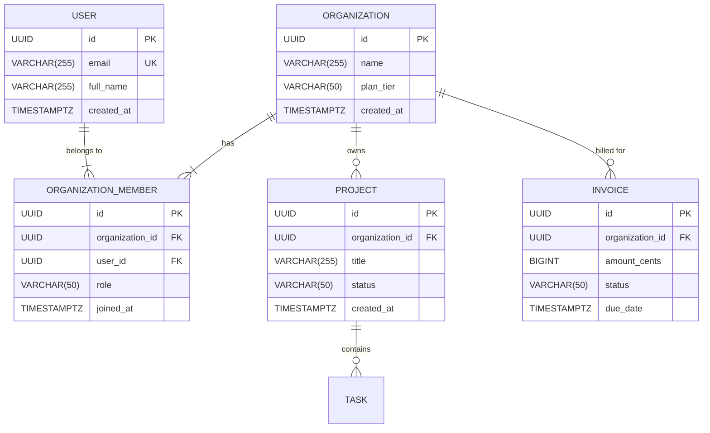

# Skill: Entity Relationship (ERD) & Data Model Diagram Synthesis
`id`: `kbcodedev/entity-relationship-erd-synthesis`  
`category`: `17-visual-architecture-diagrams`  
`version`: `2.0.0`  
`type`: `advanced-simplified`

---

## 1. Intent & Trigger Conditions
- **When to Use**: Synthesizing clean, accurate Entity Relationship Diagrams (ERD) in Mermaid and PlantUML with standard Crow's Foot cardinality notation, primary/foreign keys, and data types.
- **Triggers**: Database schema design, relational data modeling, documenting ORM relationships, DB migration reviews.
- **Prerequisites**: Entity definitions, primary/foreign keys, cardinality rules (1:1, 1:N, N:M).

---

## 2. Core Mental Model & Invariant Principles
1. **Crow's Foot Cardinality Precision**:
   - `||--||` : Exactly One to Exactly One
   - `||--o{` : Exactly One to Zero or More
   - `||--|{` : Exactly One to One or More
   - `o|--o{` : Zero or One to Zero or More
2. **Explicit Key Notation**: Always denote `PK` (Primary Key), `FK` (Foreign Key), and `UK` (Unique Key) alongside SQL data types (`UUID`, `VARCHAR`, `TIMESTAMPTZ`).
3. **No Hidden Join Tables**: Always model many-to-many junction tables (`N:M`) explicitly as relational join entities.

---

## 3. High-Signal Execution Workflow

```
[Domain Entity Requirements]
              │
              ▼
┌─────────────────────────────┐
│ Step 1: Identify Entities   │ ── Users, Organizations, Invoices, Subscriptions
└─────────────┬───────────────┘
              ▼
┌─────────────────────────────┐
│ Step 2: Define Attributes   │ ── Primary Keys (UUID), Foreign Keys, Timestamps
└─────────────┬───────────────┘
              ▼
┌─────────────────────────────┐
│ Step 3: Determine Cardinality ── 1:N (Org to Projects), N:M via Junction
└─────────────┬───────────────┘
              ▼
┌─────────────────────────────┐
│ Step 4: Render Mermaid ERD  │ ── Clean, copy-pasteable Mermaid erDiagram
└─────────────────────────────┘
```

---

## 4. Input / Output Contracts

### Input Contract
```json
{
  "system": "Multi-Tenant SaaS B2B Platform",
  "entities": ["Organization", "User", "OrganizationMember", "Project", "Invoice"]
}
```

### Output Contract


---

## 5. Anti-Patterns & Critical Traps
- ❌ **Ambiguous Cardinality**: Using simple straight lines without specifying whether relationships are `1:N` or `N:M`.
- ❌ **Missing Foreign Key References**: Drawing relationship lines between tables without declaring the matching `UUID organization_id FK` column.
- ❌ **Over-Crowded Megagraphs**: Combining 50 tables into a single unreadable image instead of scoping by bounded context (e.g. Auth ERD vs Billing ERD).

---

## 6. Real-World Production Example

```markdown
**Multi-Tenant ERD Verification**:
- Generated Mermaid ERD for multi-tenant billing.
- Visualized junction table `ORGANIZATION_MEMBER` clarifying role-based permissions before database migrations were executed.
```
