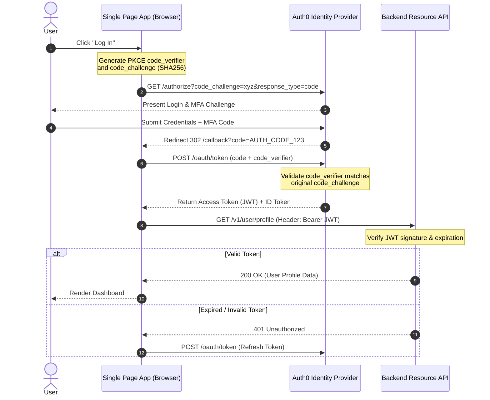

# Skill: Sequence Flow & Protocol Diagram Synthesis
`id`: `kbcodedev/sequence-flow-diagram-synthesis`  
`category`: `17-visual-architecture-diagrams`  
`version`: `2.0.0`  
`type`: `advanced-simplified`

---

## 1. Intent & Trigger Conditions
- **When to Use**: Generating precise, clear, and unambiguous sequence diagrams in Mermaid, PlantUML, and ASCII for complex authentication protocols, payment handshakes, distributed consensus, and multi-service event flows.
- **Triggers**: Documenting complex API flows, OAuth 2.0 / SAML handshakes, webhook lifecycle visualization, RFC technical design documentation.
- **Prerequisites**: Actors, service participants, synchronous/asynchronous message sequences.

---

## 2. Core Mental Model & Invariant Principles
1. **Clear Participant Lifelines & Protocols**: Explicitly label all participants (Client, Gateway, Auth Service, Database, External API) and include communication protocols (`HTTPS`, `gRPC`, `AMQP`, `SQL`) on every message arrow.
2. **Synchronous vs Asynchronous Notation**: Use solid arrows (`->>`) for synchronous blocking requests; use dashed/open arrows (`-->>` or `-.-`) for asynchronous responses and background event deliveries.
3. **Explicit Error & Alternate Paths (`alt` / `opt`)**: Always include alternate error flows (e.g. invalid signature, token expired) inside `alt` blocks.

4. **Project-Grounding Invariant (MANDATORY)**: Every version number, package name, API signature, CLI flag, file path, numeric threshold and code sample in this skill is an **illustrative reference pattern from a known-good configuration — never a literal instruction to paste**. Before changing the target codebase: (a) inspect the real project (dependency manifest and lockfile, installed toolchain, existing module layout, current implementations of anything you are about to modify — grep and symbol hits are discovery, only the actual function body is proof of behaviour); (b) reconcile each example here against what you find and adapt its specifics (versions, names, paths, thresholds) while keeping the principle intact; (c) where this skill and the real code disagree, **the real code wins** — follow it and say so plainly. Any numeric bound stated here (step budget, timeout, pool size, retry count, coverage %, latency target) is a **starting heuristic to be re-derived from the project's own evidence**, not a fixed constant. Nothing may be reported as verified until it has been checked against the running implementation; an unverified claim is delivered as unverified, never as fact.

---

## 3. High-Signal Execution Workflow

```
[Complex Multi-Service Handshake Spec]
                  │
                  ▼
┌─────────────────────────────────┐
│ Step 1: Define Participants     │ ── Client, API Gateway, Auth, Postgres, Stripe
└─────────────────┬───────────────┘
                  ▼
┌─────────────────────────────────┐
│ Step 2: Map Synchronous Request │ ── Primary happy path request/response
│         Flow                    │
└─────────────────┬───────────────┘
                  ▼
┌─────────────────────────────────┐
│ Step 3: Add Alternate & Error   │ ── alt / else blocks for validation failures
│         Branches                │
└─────────────────┬───────────────┘
                  ▼
┌─────────────────────────────────┐
│ Step 4: Render Mermaid Output   │ ── Structured, copy-pasteable Mermaid text
└─────────────────────────────────┘
```

---

## 4. Input / Output Contracts

### Input Contract
```json
{
  "flow_name": "OAuth 2.0 Authorization Code Flow with PKCE",
  "participants": ["Browser", "Single Page App", "Auth0 IdP", "Backend API"]
}
```

### Output Contract


---

## 5. Anti-Patterns & Critical Traps
- ❌ **Unlabeled Message Arrows**: Drawing sequence arrows without indicating what endpoint or data payload is being passed.
- ❌ **Omitting Failure Branches**: Drawing only the happy path, ignoring network timeouts, token expirations, and invalid credentials.
- ❌ **Monolithic Spaghetti Sequences**: Packing 40 steps into a single unreadable sequence diagram instead of breaking into sub-flows.

---

## 6. Real-World Production Example

```markdown
**OAuth PKCE Clarification**:
- Generated Mermaid sequence diagram for PKCE mobile auth.
- Prevented team from storing client secret in mobile binary by clearly illustrating PKCE dynamic challenge verification.
```
