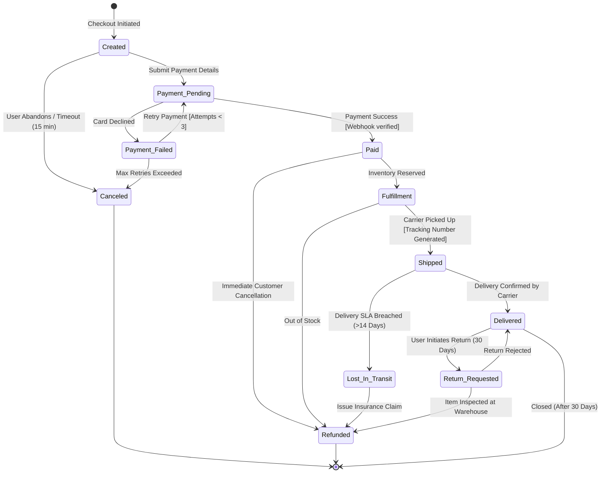

# Skill: State Machine & Lifecycle Transition Diagram Synthesis
`id`: `kbcodedev/state-machine-transition-diagram`  
`category`: `17-visual-architecture-diagrams`  
`version`: `2.0.0`  
`type`: `advanced-simplified`

---

## 1. Intent & Trigger Conditions
- **When to Use**: Modeling complex entity state lifecycles, finite state machines (FSM), order processing, subscription status changes, and circuit breaker transitions using Mermaid state diagrams.
- **Triggers**: State transition logic design, race condition elimination in entity lifecycles, payment status modeling, drafting workflow specs.
- **Prerequisites**: List of states, allowed transition events, terminal states.

---

## 2. Core Mental Model & Invariant Principles
1. **Deterministic State Transitions**: An entity in state $S_1$ receiving event $E$ must transition deterministically to exactly one state $S_2$. Illegal transitions must throw an explicit error.
2. **Explicit Terminal States (`[*]`)**: Clearly identify terminal states (e.g. `Canceled`, `Refunded`, `Archived`) from which no further state transitions are permitted.
3. **Guard Conditions & Actions**: Annotate transition arrows with triggering events and required guard conditions (`[guard] / action`).

---

## 3. High-Signal Execution Workflow

```
[Entity Lifecycle Requirements (e.g. Subscription)]
                        │
                        ▼
┌──────────────────────────────────────────────┐
│ Step 1: Identify Initial & Terminal States   │ ── Start -> Active -> Canceled -> Terminal
└──────────────────────┬───────────────────────┘
                        ▼
┌──────────────────────────────────────────────┐
│ Step 2: Map Intermediate Transient States    │ ── Past_Due, Trialing, Paused, Pending_Retry
└──────────────────────┬───────────────────────┘
                        ▼
┌──────────────────────────────────────────────┐
│ Step 3: Define Event Triggers & Guards       │ ── PaymentSuccess, PaymentFailed [retries < 3]
└──────────────────────┬───────────────────────┘
                        ▼
┌──────────────────────────────────────────────┐
│ Step 4: Render Mermaid stateDiagram-v2       │ ── Clean, copy-pasteable Mermaid text
└──────────────────────────────────────────────┘
```

---

## 4. Input / Output Contracts

### Input Contract
```json
{
  "entity": "E-Commerce Order Lifecycle",
  "states": ["Created", "Payment_Pending", "Paid", "Fulfillment", "Shipped", "Delivered", "Canceled", "Refunded"]
}
```

### Output Contract


---

## 5. Anti-Patterns & Critical Traps
- ❌ **Allowing Undefined Transitions**: Allowing code to transition directly from `Refunded` back to `Shipped` without state validation.
- ❌ **Missing Timeout Transitions**: Leaving entities stranded in transient states (e.g. `Payment_Pending`) indefinitely without automated timeout transitions.
- ❌ **Circular Zombie Loops**: Allowing states to loop infinitely without an exit gate or retry limit.

---

## 6. Real-World Production Example

```markdown
**State Machine Refactoring**:
- Implemented XState / Prisma state machine for subscription billing.
- Eliminated edge-case bug where users in `CANCELED` status were charged monthly renewals due to missing state guard assertions.
```
